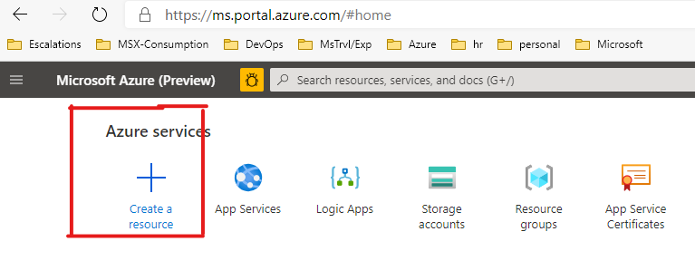
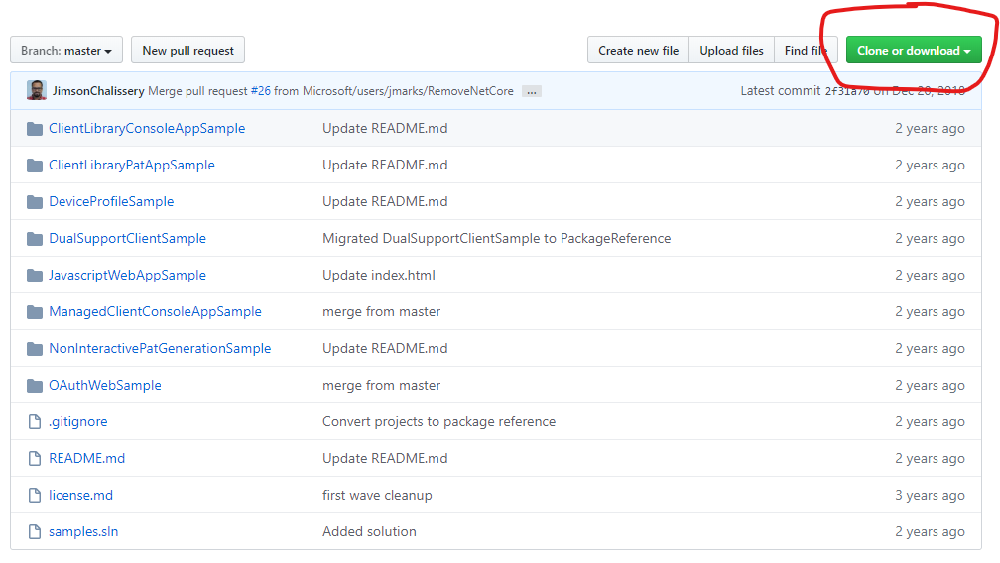

# Getting access token for DevOps REST APIs

This tutorial is an implementation of the guidence on _how to authorize access to Azure DevOps Rest APIs_ that is available [here][1].In this tutorial you will
- [Create a web application](#u1) based on the [sample application][2] available on github 
- [Register the web application](#u2) with Azure DevOps. 
- [Authorize your web application](#u3) to access your Azure DevOps organizations with the specific scopes your application needs(scopes will let you control the actions that your application can perform in your Azure DevOps Organizations).Once the authorization is complete, your application will get an authorization code.Your application will use the authorization code to get the access token for the Rest APIs. 
- [Learn how to refresh the access token](#u4) using a refresh token

## <a name="u1"> Create web application

Create an ASP.NET web app and deploy to Azure App Service by following the steps below.

1. Create an Azure App Service Web App from [Azure portal][4] following the steps below  

   1. Login to Azure portal > Click on Create Resource  
   
   
      
   

2. Clone or download the repo, [microsoft/azure-devops-auth-samples][3] from github.  

   
  
3.

## <a name="u2">  Register web application with Azure DevOps

## <a name="u3">  Authorize your web application and get access token

## <a name="u4">  Refresh your access token as needed

[1]:https://docs.microsoft.com/en-us/azure/devops/integrate/get-started/authentication/oauth?view=azure-devops&viewFallbackFrom=vsts
[2]:https://github.com/microsoft/azure-devops-auth-samples/tree/master/OAuthWebSample
[3]:https://github.com/microsoft/azure-devops-auth-samples
[4]:https://portal.azure.com
