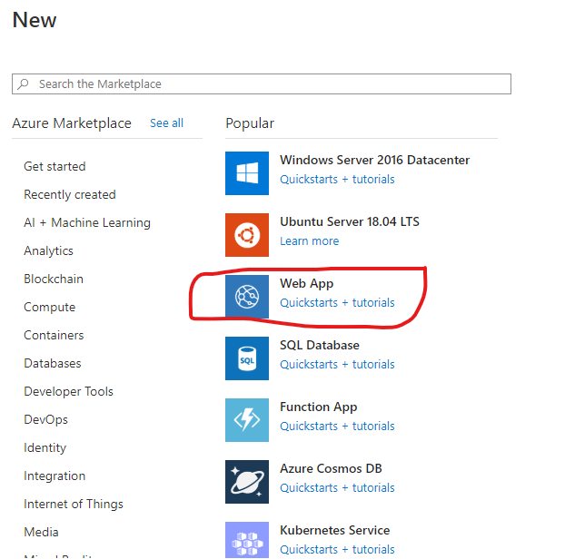

# Getting access token for DevOps REST APIs

This tutorial is an implementation of the guidence on _how to authorize access to Azure DevOps Rest APIs_ that is available [here][1]. 

In this tutorial you will:
- [Create an Azure App Service Web App and register it with with Azure DevOps.](#u1)  
- [Create an ASP .NET application](#u2) based on the [sample application][2] available on github and deploy it to Azure App Service Web App created above.
- [Get Azure DevOps REST API access token using your application](#u3). 
- [Learn how to refresh the access token using a refresh token](#u4) 

## <a name="u1"> Create web application

Create an ASP.NET web app and deploy to Azure App Service by following the steps below.

### 1. Create an Azure App Service Web App from [Azure portal][4] following the steps below  

   1. Login to Azure portal > Click on Create a resource
      
        
      
   2. Click on create Web App
      
        
      
   3. Fill out the mandatory fields like resource group etc.Select **ASP.NET V4.7** in the Runtime stack field, and **Code** in the
   Publish field. You can accept the defaults for the rest of the fields. Click on review and create.  
   
         
       
   4. Once the web app is created, go to the web app in Azure portal and note down the web app url  
      
         
   
    
   5. Clone or download the repo, [microsoft/azure-devops-auth-samples][3] from github.  

       
   6. 
  

### 3.

## <a name="u2">  Register web application with Azure DevOps

## <a name="u3">  Authorize your web application and get access token

## <a name="u4">  Refresh your access token as needed

[1]:https://docs.microsoft.com/en-us/azure/devops/integrate/get-started/authentication/oauth?view=azure-devops&viewFallbackFrom=vsts
[2]:https://github.com/microsoft/azure-devops-auth-samples/tree/master/OAuthWebSample
[3]:https://github.com/microsoft/azure-devops-auth-samples
[4]:https://portal.azure.com
