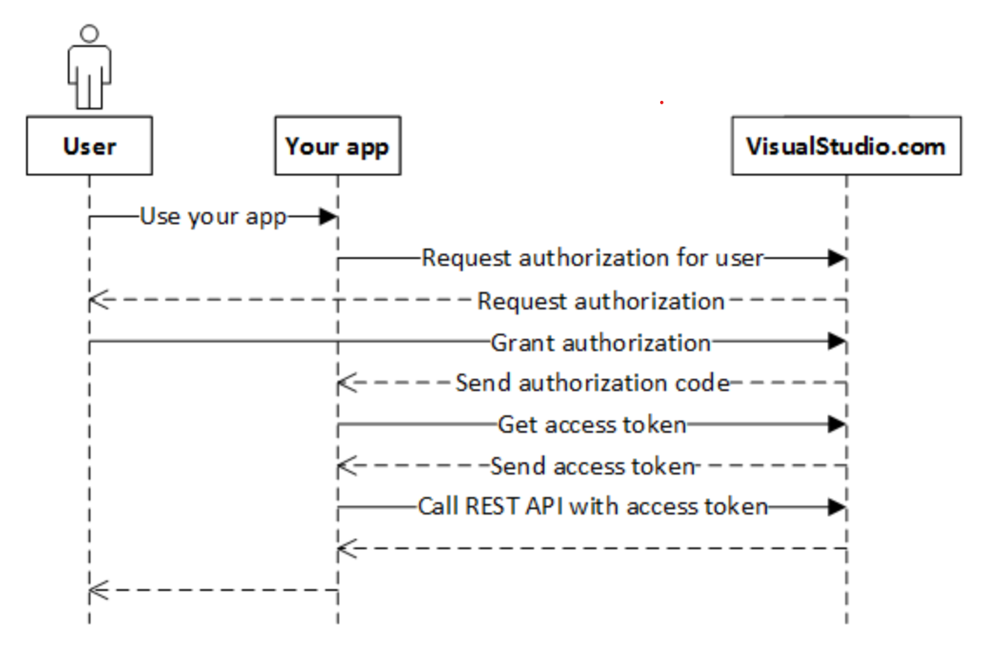

# Connect and perform Azure DevOps operations using Azure DevOps Rest APIs

Apart from the UI, Azure DevOps also provides REST APIs if you want to programatically perform Azure DevOps actions such as creating work items in Azure DevOps. As described in the [documentation][2], Azure DevOps supports multiple authentication mechanisms to authenticate to Azure DevOps REST APIs. This tutorial show how to create a work item in Azure DevOps Boards via REST API calls using OAuth 2.0 authentication. The following diagram from [Azure DevOps documentation][3] dipicts the flow for authenticating and invoking an Azure DevOps REST API.

  
  
In this tutorial you will learn how to:  

  [Authenticate with Azure DevOps using OAuth2 and get an access token][1]  
  [Use access token to create a work item in Azure Boards by calling Azure DevOps REST APIs][4]

  
When you are finished, you would have successully created a work item in Azure DevOps boards with data in system and custom fields, by invoking Azure DevOps Rest APIs. 

  

  
[1]: https://github.com/aj3705/AzureDevOps/blob/master/restapis/ado-authentication.md
[2]:https://docs.microsoft.com/en-us/rest/api/azure/devops/?view=azure-devops-rest-5.1
[3]:https://docs.microsoft.com/en-us/azure/devops/integrate/get-started/authentication/oauth?view=azure-devops&viewFallbackFrom=vsts
[4]:https://github.com/aj3705/AzureDevOps/blob/master/restapis/create-ado-work-item.md
