# Create Azure DevOps work item using Azure DevOps REST APIs.  

**Prerequisite:** If you have not already done so, please follow the steps in [Getting access token for DevOps REST APIs][2] to get the access token for DevOps REST APIs . 

In this tutorial, you will:
- [Configure a custom process for your Azure DevOps project to add a custom field to Azure Boards work item.](#u1)
- [Using the access token obtained in the previous tutorial, you will create a work item in Azure Boards by invoking Azure DevOps REST API](#u2)


## <a name="u1"> Add custom field(s) to your Azure Boards work items
  
  ### Steps
   
  1. Login to Azure DevOps > Select your project > Project Settings > Boards > Project Configuration
  2. Click on the _got to the process customization page_ link  
       
     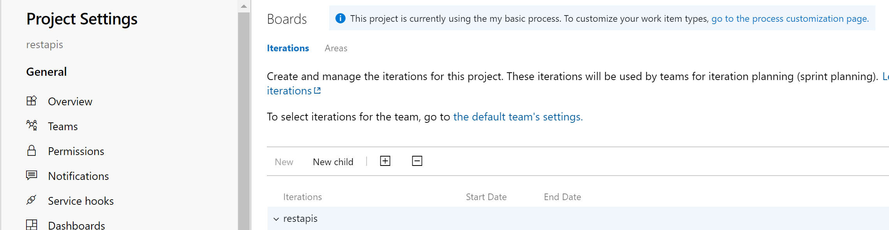  
     
  3. Click on All Processes > **...** next to Basic > Create inherited process
     
     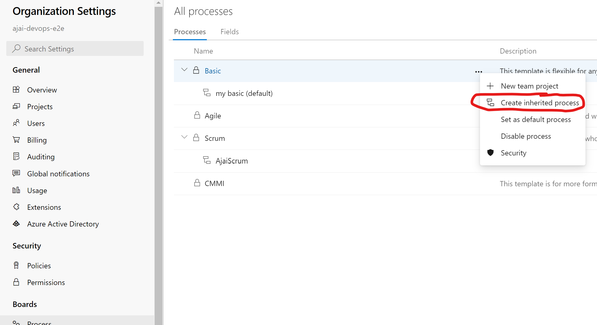  
     
  4. Enter a name and description and click on "cerate custom process"
  
      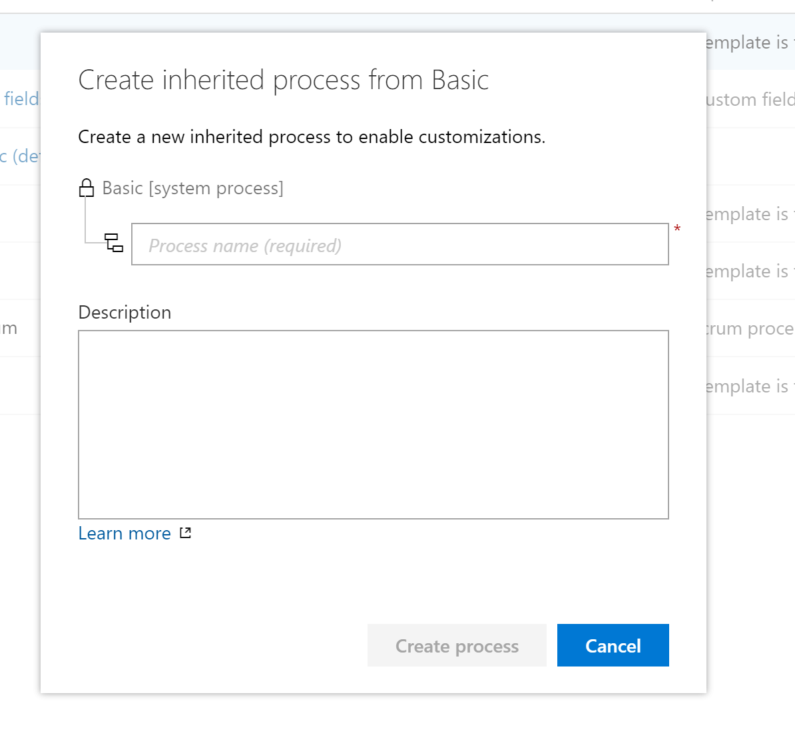  
  
  5. Click on the new process > issue > new field
  
     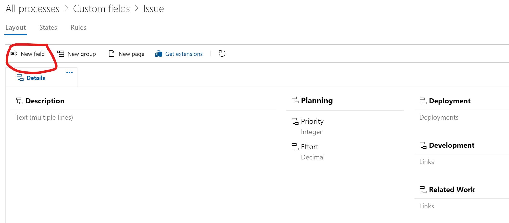  
     
  6. Enter "application" for name and click on add field
    
     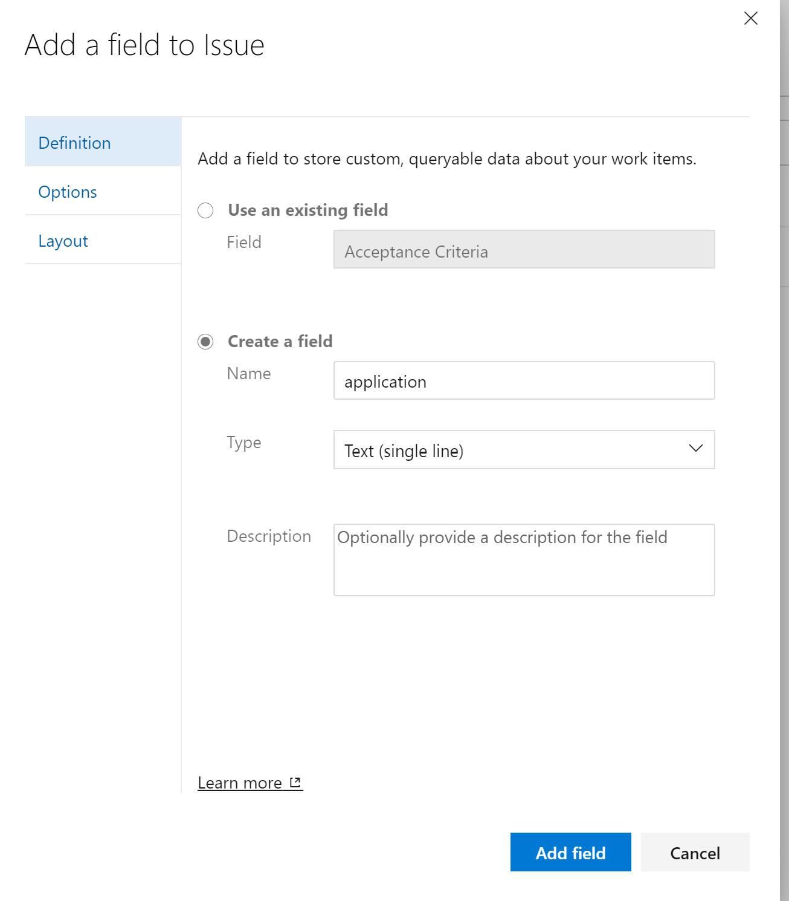 
     
  7. Go to Organization Settings > Boards > Process and find your project under team projects
    
     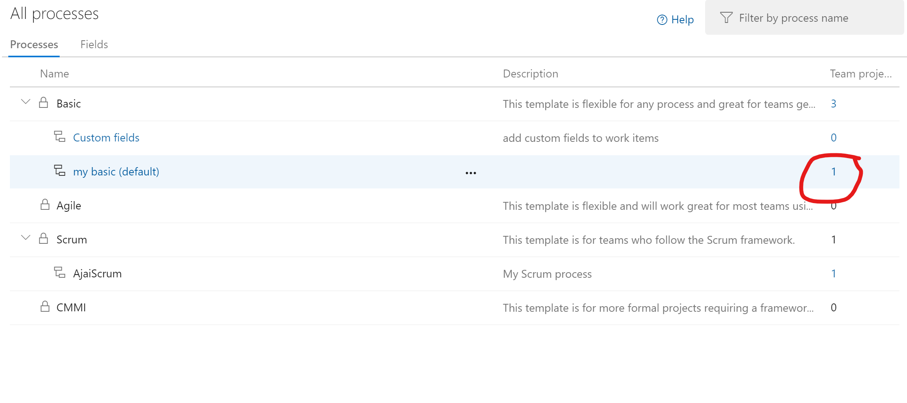 
  
  8. Click **...** next to your project name > change process
    
     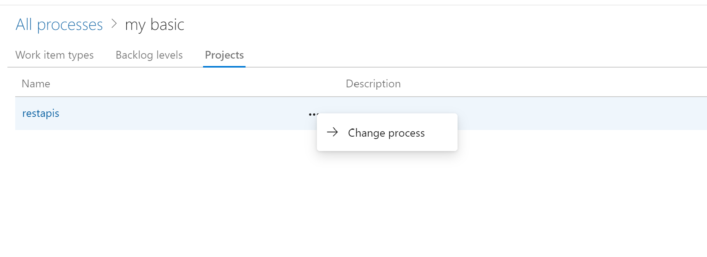 
     
  9. Select the new process you created in the "target process" drop down and click save.
    
     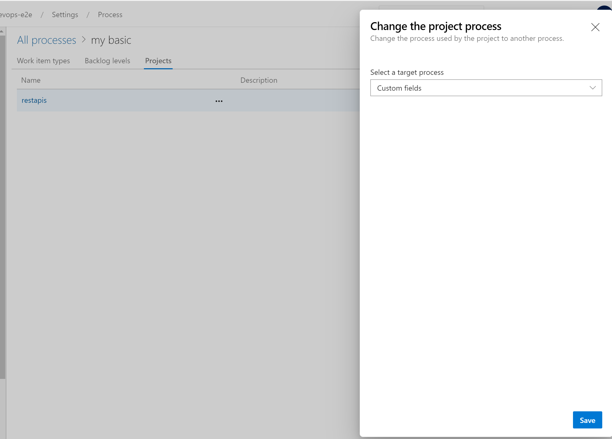 
     
You have successfully changed the process for your project. The custom field, "application" you added will show up in any new work item you create.


  
## <a name="u2"> Create work item using Azure DevOps REST API
  
  You will use Postman to invoke Azure DevOPs REST APIs. If you do not already have it, you can download it from [here][1].
  
  ### Steps  
  
  1. Open your Postman App and create a new http request by clicking on the **+** sign. 
  2. Select POST from drop down as the Request type
  3. Click on authorization and select Bearer Token from the TYPE drop down.  
     
     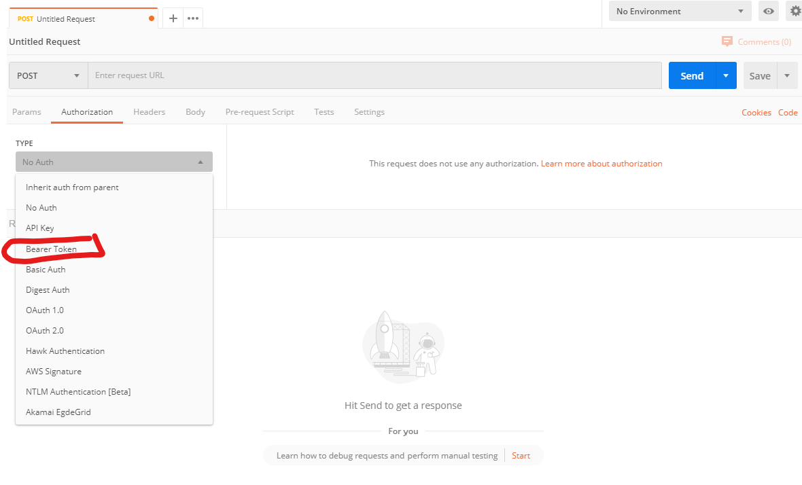  
  4. Copy paste the Azure DevOps access token that you obtained in the [tutorial][2] on how to get access token.  
      
     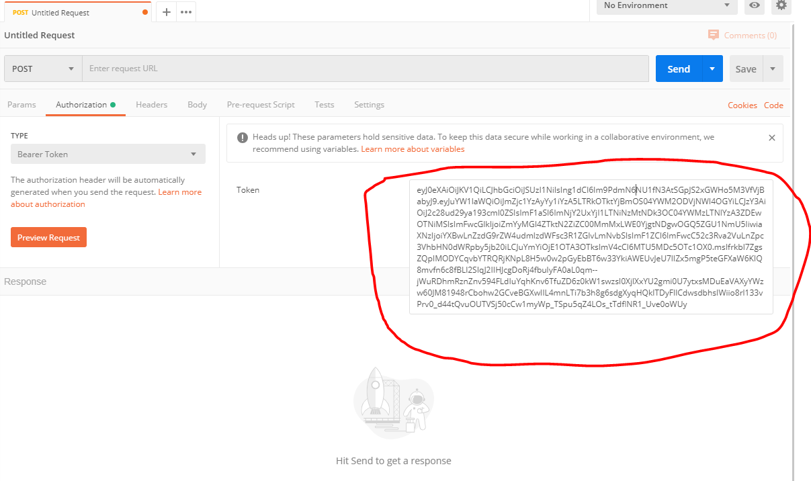  
     
  5. Populate the url field as follows:
     
     ```
     https://dev.azure.com/{organization}/{project}/_apis/wit/workitems/$issue?api-version=5.1
     
     ```
  6. Populate the request body with the following JSON for creating work item in Azure DevOps Boards.Note that we are populating built-in fields as well as **a custom field called "application"**. 
  
     ```
      [
        {
          "op": "add",
          "path": "/fields/System.Title",
          "from": null,
          "value": "SampleWorkItem"
        },
        {
          "op": "add",
          "path": "/fields/System.Description",
          "from": null,
          "value": "This is a sample workitem created using Azure DevOps REST APIs"
        },
        {
          "op": "add",
          "path": "/fields/Activity",
          "from": null,
          "value": "Development"
        },
         {
          "op": "add",
          "path": "/fields/application",
          "from": null,
          "value": "This is a custom field"
        }
      ]
     ```
     **Request body in Postman:**
     
     Select "raw" and copy paste the above in the request body section.
     
      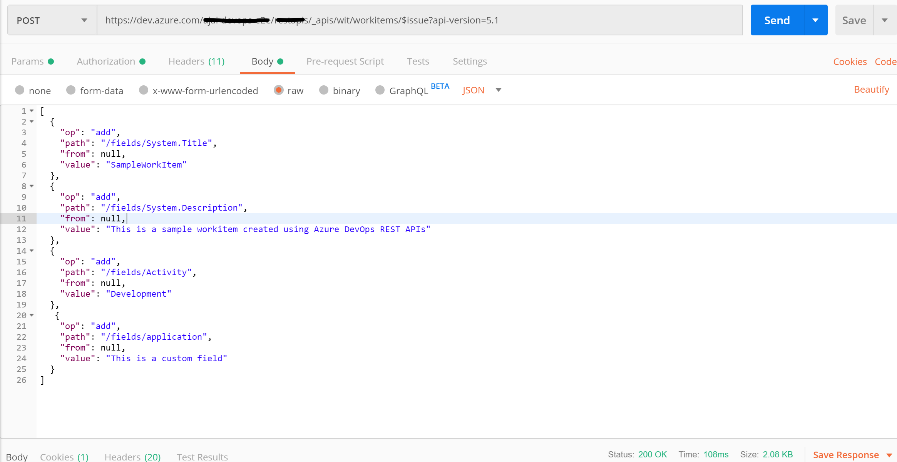  
      
  7. Click on send. You should see a response like the following, in the response window.
    
     ```
     
      {
        "id": 281,
        "rev": 1,
        "fields": {
            "System.AreaPath": "restapis",
            "System.TeamProject": "restapis",
            "System.IterationPath": "restapis",
            "System.WorkItemType": "Issue",
            "System.State": "To Do",
            "System.Reason": "Added to backlog",
            "System.CreatedDate": "2020-05-30T17:35:51.007Z",
            "System.CreatedBy": {
                "displayName": "John Doe",
                "url": "https://spsprodcus2.vssps.visualstudio.com/Ac0480758-daf6-4e5f-8fa2-068e5186778c/_apis/Identities/ff75c02c-bc09-4d99-b0f9-8ac685c5b88f",
                "_links": {
                    "avatar": {
                        "href": "https://dev.azure.com/John-devops-e2e/_apis/GraphProfile/MemberAvatars/aad.OTRhYWMzY2YtOTVkMy03OWE1LTk0NzEtOGRmYjJhZGIzMzYw"
                    }
                },
                "id": "ff75c02c-bc09-4d99-b0f9-8ac685c5b88f",
                "uniqueName": "johndoe@xyz.com",
                "imageUrl": "https://dev.azure.com/John-devops-e2e/_apis/GraphProfile/MemberAvatars/aad.OTRhYWMzY2YtOTVkMy03OWE1LTk0NzEtOGRmYjJhZGIzMzYw",
                "descriptor": "aad.OTRhYWMzY2YtOTVkMy03OWE1LTk0NzEtOGRmYjJhZGIzMzYw"
            },
            "System.ChangedDate": "2020-05-30T17:35:51.007Z",
            "System.ChangedBy": {
                "displayName": "John Doe",
                "url": "https://spsprodcus2.vssps.visualstudio.com/Ac0480758-daf6-4e5f-8fa2-068e5186778c/_apis/Identities/ff75c02c-bc09-4d99-b0f9-8ac685c5b88f",
                "_links": {
                    "avatar": {
                        "href": "https://dev.azure.com/John-devops-e2e/_apis/GraphProfile/MemberAvatars/aad.OTRhYWMzY2YtOTVkMy03OWE1LTk0NzEtOGRmYjJhZGIzMzYw"
                    }
                },
                "id": "ff75c02c-bc09-4d99-b0f9-8ac685c5b88f",
                "uniqueName": "johndoe@xyz.com",
                "imageUrl": "https://dev.azure.com/John-devops-e2e/_apis/GraphProfile/MemberAvatars/aad.OTRhYWMzY2YtOTVkMy03OWE1LTk0NzEtOGRmYjJhZGIzMzYw",
                "descriptor": "aad.OTRhYWMzY2YtOTVkMy03OWE1LTk0NzEtOGRmYjJhZGIzMzYw"
            },
            "System.CommentCount": 0,
            "System.Title": "SampleWorkItem",
            "System.BoardColumn": "To Do",
            "System.BoardColumnDone": false,
            "Microsoft.VSTS.Common.Activity": "Development",
            "Microsoft.VSTS.Common.StateChangeDate": "2020-05-30T17:35:51.007Z",
            "Microsoft.VSTS.Common.Priority": 2,
            "WEF_85808D61BB4841AFA45B316010843052_Kanban.Column": "To Do",
            "WEF_85808D61BB4841AFA45B316010843052_Kanban.Column.Done": false,
            "Custom.application": "This is a custom field",
            "System.Description": "This is a sample workitem created using Azure DevOps REST APIs"
        },
        "_links": {
            "self": {
                "href": "https://dev.azure.com/John-devops-e2e/87e90748-cb99-4fe2-bf81-125980e6fc89/_apis/wit/workItems/281"
            },
            "workItemUpdates": {
                "href": "https://dev.azure.com/John-devops-e2e/87e90748-cb99-4fe2-bf81-125980e6fc89/_apis/wit/workItems/281/updates"
            },
            "workItemRevisions": {
                "href": "https://dev.azure.com/John-devops-e2e/87e90748-cb99-4fe2-bf81-125980e6fc89/_apis/wit/workItems/281/revisions"
            },
            "workItemComments": {
                "href": "https://dev.azure.com/John-devops-e2e/87e90748-cb99-4fe2-bf81-125980e6fc89/_apis/wit/workItems/281/comments"
            },
            "html": {
                "href": "https://dev.azure.com/John-devops-e2e/87e90748-cb99-4fe2-bf81-125980e6fc89/_workitems/edit/281"
            },
            "workItemType": {
                "href": "https://dev.azure.com/John-devops-e2e/87e90748-cb99-4fe2-bf81-125980e6fc89/_apis/wit/workItemTypes/Issue"
            },
            "fields": {
                "href": "https://dev.azure.com/John-devops-e2e/87e90748-cb99-4fe2-bf81-125980e6fc89/_apis/wit/fields"
            }
        },
        "url": "https://dev.azure.com/John-devops-e2e/87e90748-cb99-4fe2-bf81-125980e6fc89/_apis/wit/workItems/281"
     }
         
     ```
     **Response in Postman:**  
     
     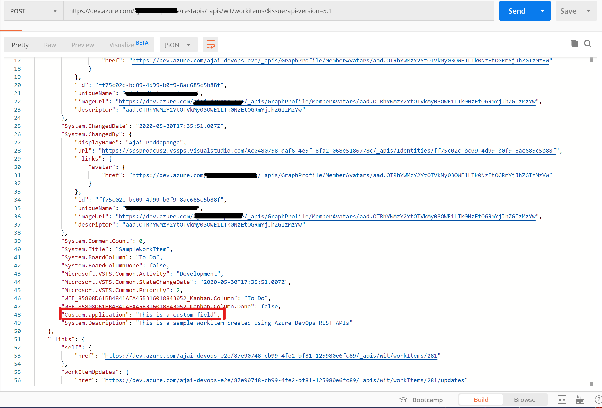  
     
   8. Loginto Azure DevOps > Click on Boards and navigate to your project. You should find the work item you just created.
   
      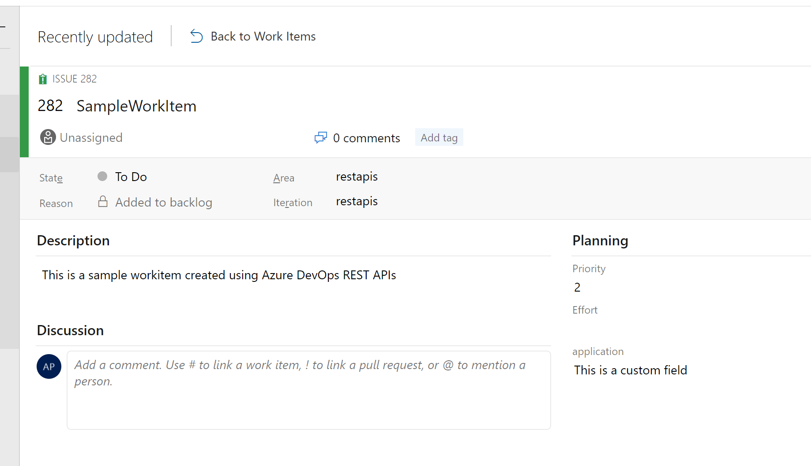  
        
       
Congrats!! you now know how to create work items in Azure Boards using REST.  

[Go to beginning of this tutorial][3]      


[1]:https://www.postman.com/downloads/
[2]:https://github.com/aj3705/AzureDevOps/blob/master/restapis/ado-authentication.md
[3]:https://github.com/aj3705/AzureDevOps/blob/master/restapis/ado-rest-api-tutorial.md
