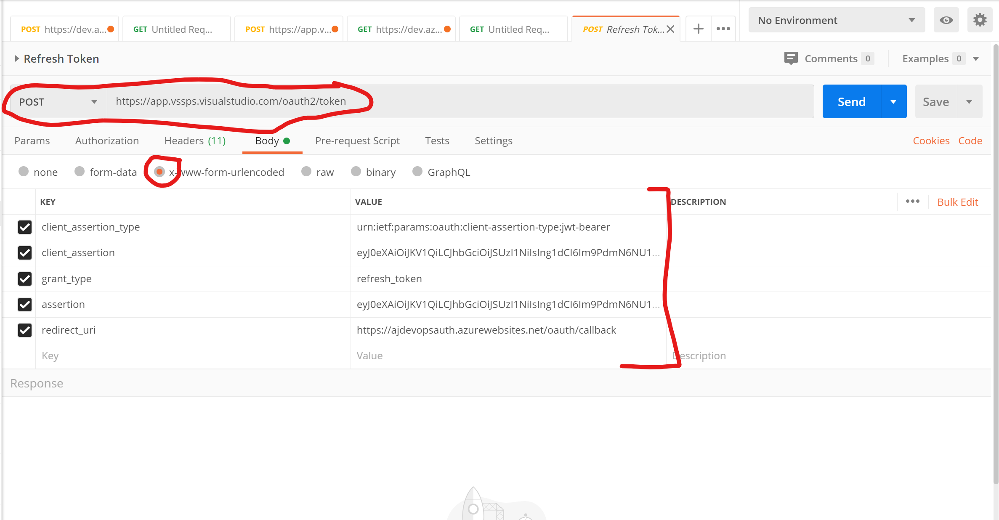
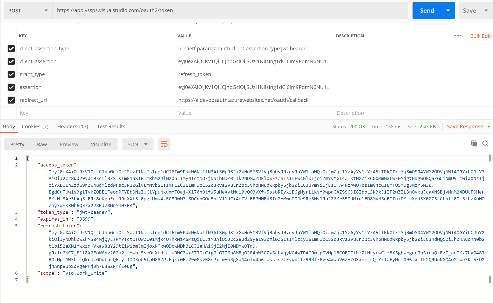

#  Refreshing OAuth access token

OAuth tokens have an expiry time associated with them. You can get a new access token before it expires using a refresh token.In this tutorial you will learn how to refresh your OAuth access token before it expires using Postman. You will need a non-expired access token and a refresh token to get a new access token.  

**Steps**

1. Open Postman application and click on **+** to create a new request
2. Select "POST" from the drop down and enter https://app.vssps.visualstudio.com/oauth2/token in the url field
3. Click on "Body" > selct  "x-www-form-urlencoded" enter the following name - value fields 
    
   - client_assertion_type = urn:ietf:params:oauth:client-assertion-type:jwt-bearer
   - client_assertion = {client secret acquired when the app was registered}
   - grant_type = refresh_token
   - assertion =  {refresh token you saved when you got the access token from Azure DevOps}
   - redirect_uri = https://{yoursitename}.azurewebsites.net/oauth/callback
   
      

4. Click "Send". You will get a new access token and a new refresh token in the response. 
    
      

5. Securely store the access and refresh tokens.

[Go to beginning of this tutorial][1]

[1]:https://github.com/aj3705/AzureDevOps/blob/master/restapis/ado-rest-api-tutorial.md
       
 
